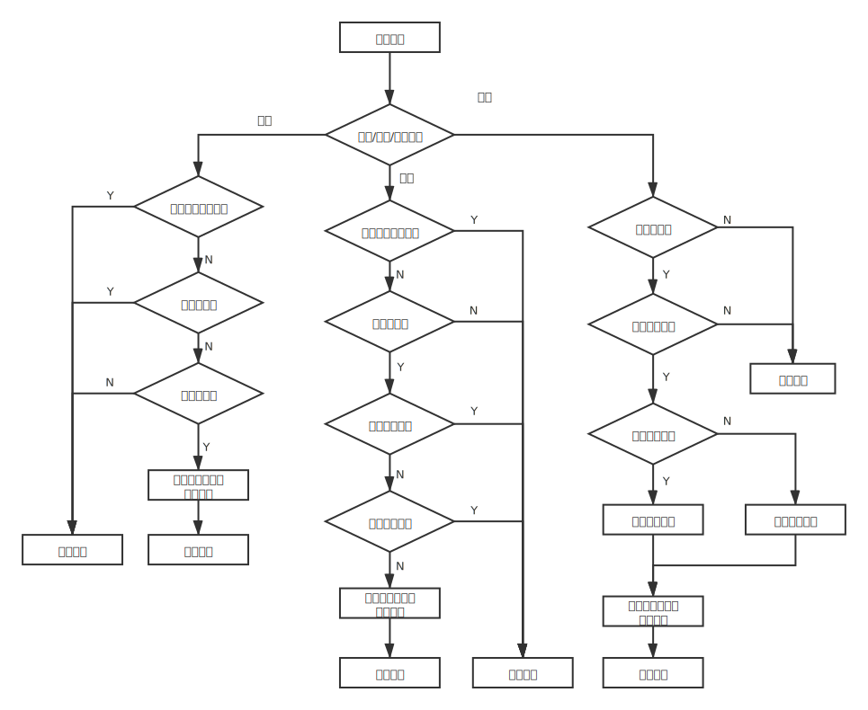
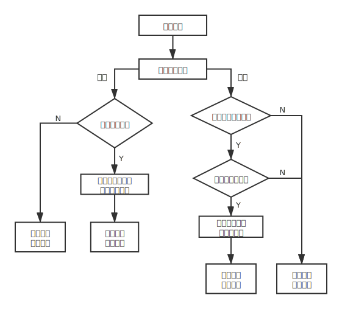

### 项目简介
这是一个实现简单聊天室的小项目。需要实现的功能如下：
* 两个在线用户之间的私聊对话
* 用户在聊天室公共频道上发布公开消息，其他聊天室内的成员可以接收到。

### 项目设计

#### 数据结构

* 服务器结构体(server)

  | 属性名           | 数据类型           | 属性解释                                         |
  | ---------------- | ------------------ | ------------------------------------------------ |
  | *user_dict*      | map<string, user>  | 用户名到用户信息的映射                           |
  | *sock_fds*       | list< int>         | 当前服务器建立的所有连接的套接字文件描述符       |
  | *fd_user_dict*   | map<int, string>   | sock_fd到其所对应的用户名的映射                  |
  | *user_fd_dict*   | map<string, int>   | 在线用户名到其所对应的sock_fd的映射              |
  | *group_dict*     | map<string, group> | 群名到群信息的映射                               |
  | *close_flag*     | bool               | 关闭服务端的意向标志，为true时说明服务端准备关闭 |
  | *max_con_num*    | int                | 服务器同时连接的客户端的最大数量                 |
  | *max_join_g_num* | int                | 用户同时加入的群的最大数量                       |
  | *max_crea_g_num* | int                | 用户创建的群的最大数量（不包括已解散的群）       |
  | *min_str_len*    | int                | 结构体属性中的字符串（key）最小长度              |
  | *max_str_len*    | int                | 结构体属性中的字符串（name/key）最大长度         |
  | *max_g_size*     | int                | 聊天群最大容量                                   |

  服务器关闭时需要存储的数据包括`user_dict`和`group_dict`，`online_users`和`user_fd_dict`默认值为空，`close_flag`默认值为**false**。（暂时先用群名和用户名作为各自的索引，后面再考虑给它们设置一个随机生成的整数id作为各自的索引。）

* 聊天群结构体(group)

  | 属性名    | 数据类型      | 属性解释               |
  | --------- | ------------- | ---------------------- |
  | *name*    | string        | 群名（唯一非空）       |
  | *members* | list< string> | 聊天室成员的用户名列表 |
  | *owner*   | string        | 群主的用户名           |

  群名`name`只能包括字母、数字或下划线，长度为$[1,max\_str\_len]$。

* 用户结构体(user)

  | 属性名         | 数据类型      | 属性解释           |
  | -------------- | ------------- | ------------------ |
  | *name*         | string        | 用户名（唯一非空） |
  | *key*          | string        | 用户口令           |
  | *join_groups*  | list< string> | 用户加入的群的列表 |
  | *creat_groups* | list< string> | 用户创建的群的列表 |
  | *online*       | bool          | true时表示用户在线 |

  用户名`name`和用户口令`key`只能包括字母、数字或下划线，用户名长度为$[1,max\_str\_len]$，用户口令`key`长度为$[min\_str\_len,max\_str\_len]$。

#### 功能设计图

##### 服务端管理

- 服务端数据存储在文件中，每次服务端开启时从文件中加载数据
- 服务端意向关闭即服务端准备关闭，此时，服务端不再接收客户端的连接请求，并且当在线客户端数量不为0时，服务端会通知客户端全部强行下线，之后服务端将数据写入文件，最后自行关闭服务端

##### 客户端服务端连接管理

##### 命令管理

- 输入正确命令时按命令执行操作；输入非法命令时提示命令非法，并且向用户展示正确的命令格式

##### 命令格式

客户端命令：

| 命令格式           | 命令含义                                                   |
| ------------------ | ---------------------------------------------------------- |
| -h                 | help，print usage of commands                              |
| -lg *u_name* *key* | user *u_name* logins with *key*                            |
| -rg *u_name* *key* | user *u_name* registers with *key*                         |
| -lo                | user logout                                                |
| -cg *g_name*       | create group *g_name*                                      |
| -jg *g_name*       | join group *g_name*                                        |
| -qg *g_name*       | quit group *g_name*                                        |
| -sg *g_name* *msg* | send message *msg* to all online members in group *g_name* |
| -su *u_name* *msg* | send message *msg* to user *u_name*                        |
| -q                 | close the client                                           |

服务端命令：

| 命令格式 | 命令含义         |
| -------- | ---------------- |
| -q       | close the server |
| -lsg     | list all groups  |

##### 用户管理

* 不对注册用户总数作限制
* 暂不考虑用户修改密码的功能。
* 同一账号异地登录时，后登录者会强迫先前登录者离线。

##### 聊天群管理

* 不对群聊总数作限制
* 群员退群时正常退出，群主退群时整个群都会被解散
* 暂不考虑群员入群需要群主通过

##### 用户聊天管理

* 暂不设置加好友功能（默认所有在线用户都是好友）
* 暂不设置离线消息功能（实现时只需要在服务端缓存离线消息，待客户端上线时再发送即可，由于该功能的添加不影响目前架构，简单起见先不设置）

#### 功能测试

测试样例

服务器1个（*S*），客户端4个（*C1*, *C2*, *C3*），测试命令行按时间顺序列举如下：

| 命令行                           | 发起端 | 目的                 |
| -------------------------------- | ------ | -------------------- |
| -rg mike                         | C1     | 注册时密码为空       |
| -rg mike mike123                 | C1     | 正常注册             |
| -lg jane jane123                 | C1     | 登录未注册账户       |
| -lg mike mike12                  | C1     | 登录时密码错误       |
| -lg mike mike123                 | C1     | 正常登录             |
| -rg jack jack123                 | C2     | 正常注册             |
| -lg jack jack123                 | C2     | 正常登录             |
| -cg group1                       | C1     | 创建群聊             |
| -cg group2                       | C1     | 创建群聊             |
| -jg group1                       | C1     | 加入自己创建的群聊   |
| -jg group1                       | C2     | 加入群聊             |
| -jg group1                       | C2     | 加入自己已加入的群聊 |
| -rg jane jane123                 | C3     | 正常注册             |
| -lg jane jane123                 | C3     | 正常登录             |
| -lg mike mike123                 | C3     | 登录后尝试再登录     |
| -jg group1                       | C3     | 加入群聊             |
| -sg group1 Hi! This is Mike.     | C1     | 发群聊消息           |
| -sg group1 Hello, Mike!          | C2     | 发群聊消息           |
| -qg group1                       | C2     | 群员退群             |
| -qg group1                       | C1     | 群主退群             |
| -su jane Long time no see, Jane! | C1     | 发送私聊消息         |
| -lsg                             | S      | 列出当前已创建的群聊 |
| -lg mike mike123                 | C4     | 异地登录             |
| -jg group1                       | C4     | 加入不存在的群       |
| -lo                              | C4     | 退出登录             |
| -q                               | C4     | 关闭客户端           |
| -q                               | S      | 关闭服务器           |

实验结果：

服务端S：

客户端C1：

客户端C2：

客户端C3：

客户端C4：

### 更新记录

#### 4/3

* 更新架构设计图
* 完成服务端管理的实现（暂不实现文件存储，即每次服务端重启状态都相同）
* 完成客户端服务端连接管理
* 完成用户注册和登录以及退出登录的功能

#### 4/2 

对整个架构进行设计。

#### 4/1

1. 功能介绍

   ​		基于[这篇博客](https://blog.csdn.net/weixin_38663899/article/details/87884938?utm_term=socket%E7%BC%96%E7%A8%8BC%E8%AF%AD%E8%A8%80%E5%AE%9E%E7%8E%B0%E8%81%8A%E5%A4%A9%E7%A8%8B%E5%BA%8F&utm_medium=distribute.pc_aggpage_search_result.none-task-blog-2~all~sobaiduweb~default-4-87884938&spm=3001.4430)的代码开发本项目，目前代码实现的功能如下：代码分为服务端和客户端，所有客户端组成一个聊天室（最大容量为`size`）。服务器启动时聊天室就创建，客户端连接服务器则加入了聊天室（也就是说，聊天室的容量等于服务器的连接量），客户端断开连接处于离线状态则退出了聊天室。用户可以在聊天频道里对所有成员发消息。

2. 暂不支持的功能以及存在的问题

   ​		暂未实现用户之间的私聊对话以及服务器主动向客户端发消息。

3. 后续开发思路：

   * 点对点的通信需要对客户端进行命名，服务端需要能提供在线用户名单
   * 客户端和服务端需要支持命令行，以支持服务端对客户端发消息（系统消息），客户端对客户端发消息（私聊消息）
   * 聊天室独立出来，由服务器系统管理，聊天室限制最大容量，服务器限制最大连接量